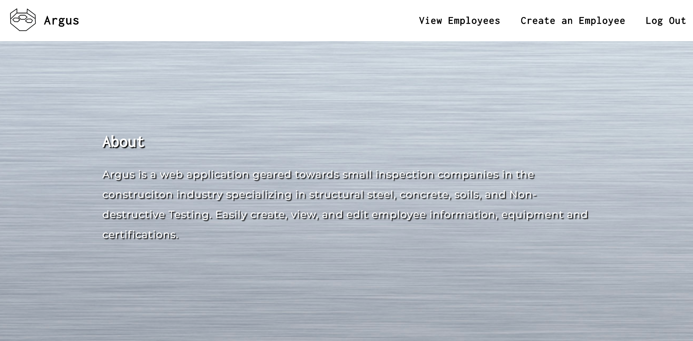
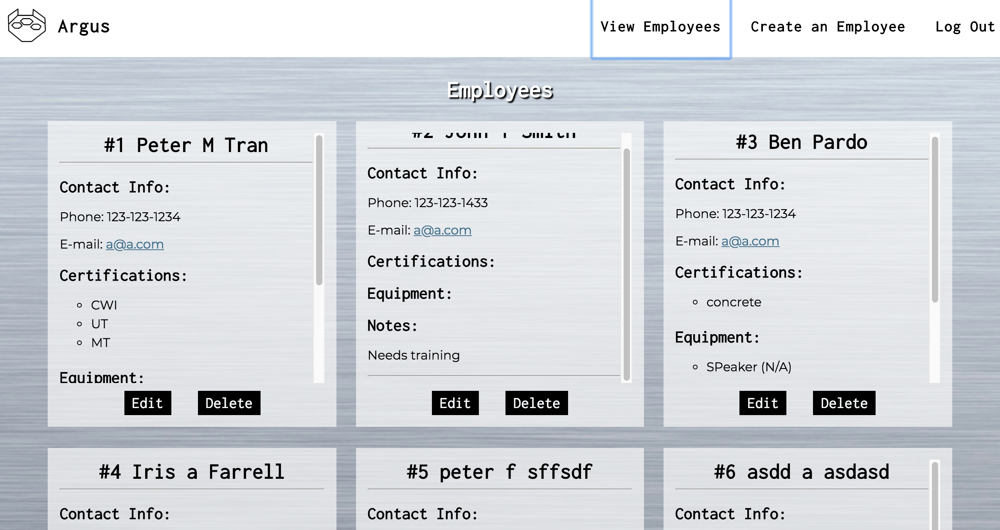
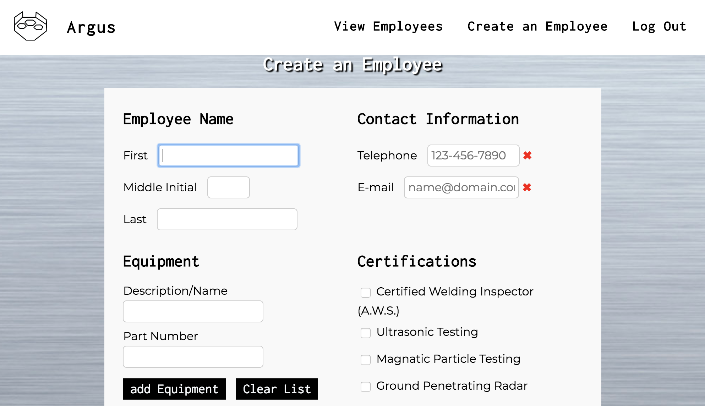

# Argus

Keep track of employees and their information (certs, equipments, contact info) for your inspection company.

# Live Site 

Access the live site [here]

[here]:https://argus-01.herokuapp.com/

# Screenshots

|  | ||
|:---:|:---:|:---:|
| Landing | View Employees | Create Employee |

# Installation

1. Clone or download to local repository.
2. Install dependencies in command line in root folder:
```bash

$ npm install
```
3. Install [mongoDB](https://docs.mongodb.com/manual/installation/)

# API Documentation

See API documentation [here](https://documenter.getpostman.com/view/4490688/RWaC4DBx).

# Summary

Argus is a web app created for small companies in constuction that specialize in special inspections such as welding, concrete, soils and non-destructive testing. Easily keep track of employees, their equipment, certifications, and contact information.

# Technical

Front end was built using:
1. HTML
2. CSS
3. Javascript
4. jQuery

Back end:
1. Node JS
2. Express
3. Mongo/Mongoose

Authentication:
1. JWT
2. Passport

Testing:
1. Mocha
2. Chai
3. Travis CI
